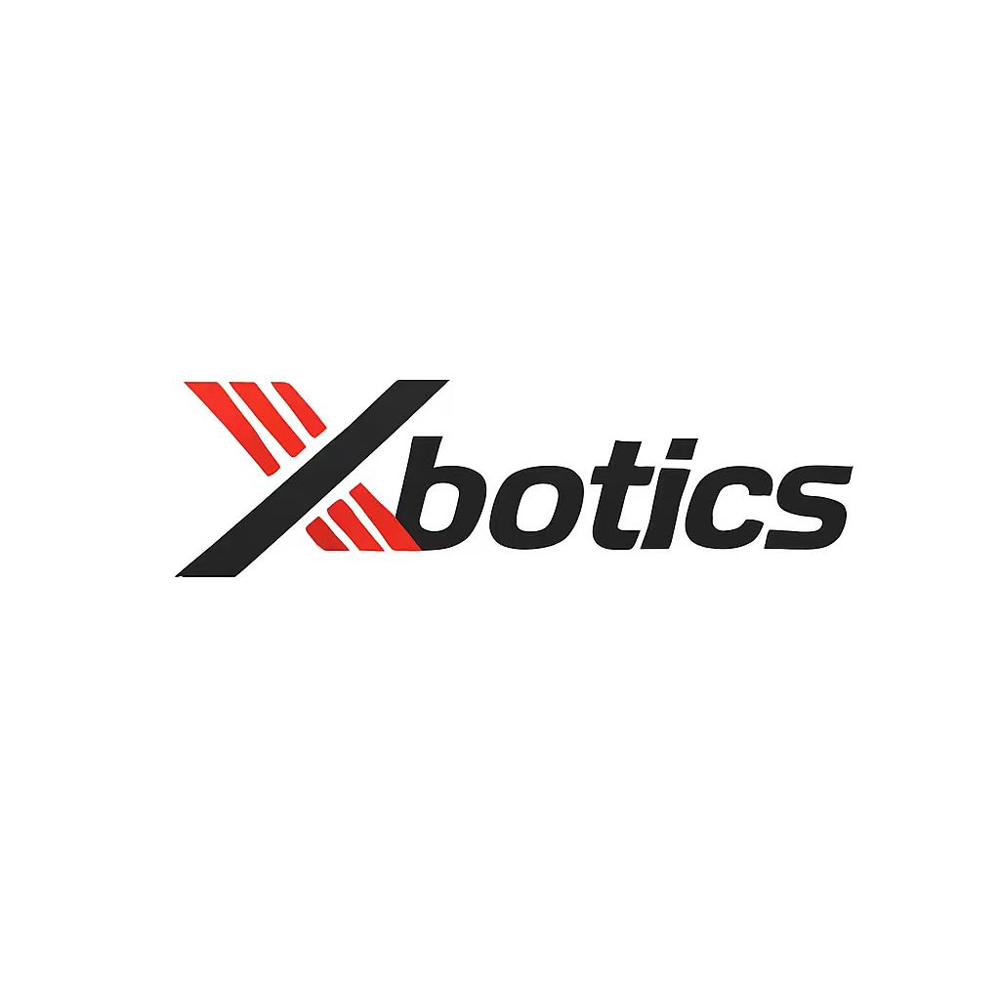
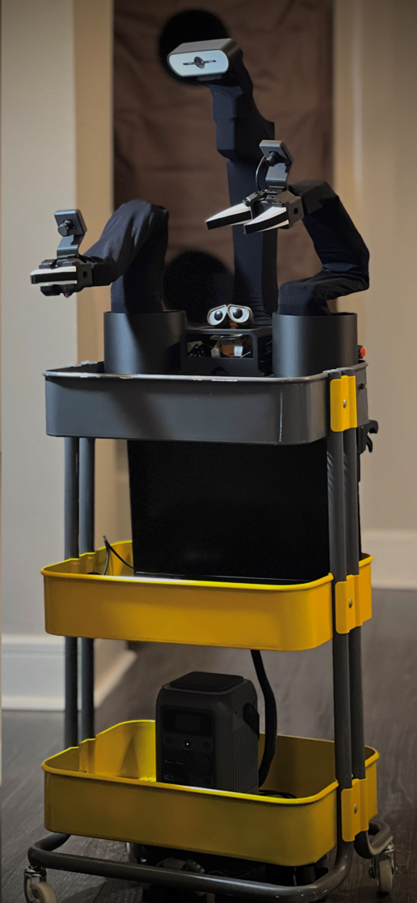
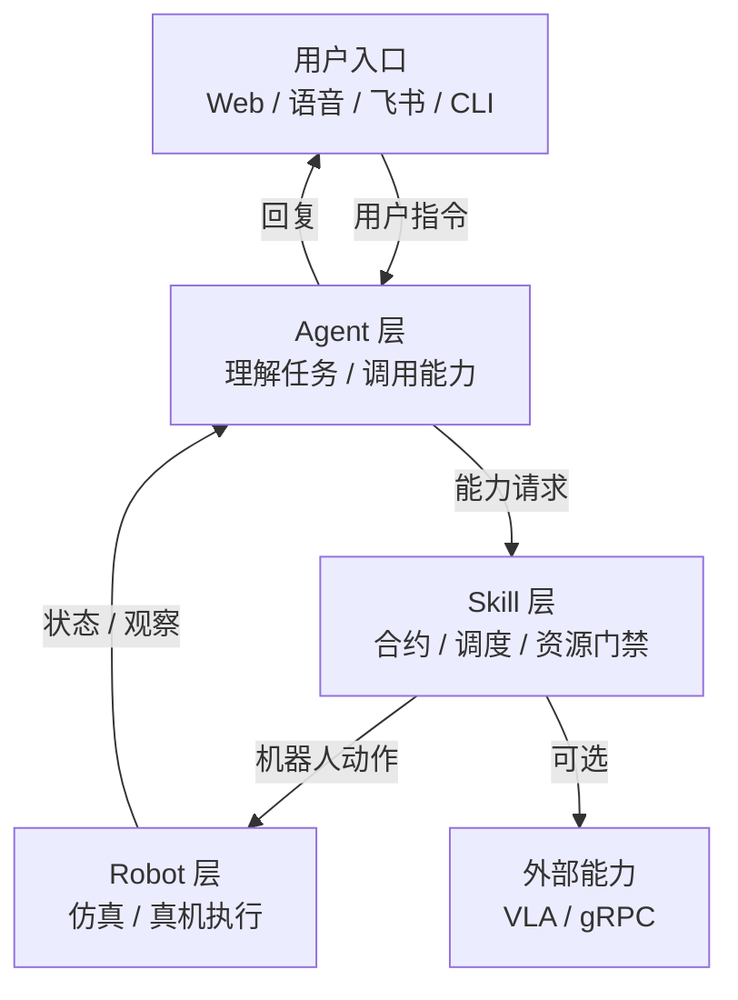

<div align="center">
  
</div>

# Hey Robot

<div align="center">
  <sub>简体中文 | <a href="docs/README_EN.md">English</a></sub>
</div>

Hey Robot 是一个面向真实机器人部署的具身 Agent runtime。它以 XLeRobot 为当前主线机器人形态，将 SO101 机械臂、LeKiwi 移动底盘、相机观察、电池/状态监控和 LLM Agent 运行时组合成一个可调度、可观察、可恢复的机器人系统。

> 项目状态：当前处于 active development。XLeRobot 仿真和真机链路均已跑通，仍建议任何硬件改动先在仿真中验证。

<p align="center">
  
</p>

## 特性

- 面向机器人任务的 LLM Agent runtime。
- Skill 层抽象：Agent 只请求机器人能力，不直接控制硬件。
- 支持 MuJoCo 仿真和 XLeRobot 真机部署。
- 支持 Web、CLI、语音、飞书等用户入口。
- 内置 task cockpit：展示任务状态、timeline、scene evidence 和 recovery。
- VLA 能力通过独立 capability service 接入，不塞进 robot driver。
- 支持 execution feedback、resource gate、readiness gate、timeout 和恢复流程。

## 架构



核心边界：

- `Robot` 只表示身体和硬件执行边界。
- `Skill` 是 Agent 调用机器人能力的统一入口。
- Agent 通过 `request_capability` 调用机器人 skill，不直接提交 `RobotAction`。
- `RobotService / RobotRuntime / PerceptionService` 负责 observation 与相机帧发布。
- VLA 能力通过独立 capability service 接入，当前作为可选扩展能力逐步验证。

## 快速开始

### 1. 环境要求

- Python 3.12
- [uv](https://github.com/astral-sh/uv)
- NATS server
- MuJoCo，用于 XLeRobot 仿真
- XLeRobot 真机硬件，用于真实机器人部署

### 2. 安装依赖

```bash
uv sync --dev
```

如果需要仿真：

```bash
uv sync --dev --extra sim
```

### 3. 配置环境变量

```bash
cp .env.example .env
```

根据使用的 provider 填写 `.env`。常用变量：

```text
DEEPSEEK_API_KEY
DEEPSEEK_MODEL
DASHSCOPE_API_KEY
DASHSCOPE_MODEL
ARK_API_KEY
```

### 4. 启动 NATS

```bash
nats-server
```

也可以只用 Docker 启动 NATS：

```bash
docker compose up nats
```

### 5. 运行 XLeRobot 仿真

```bash
uv run hey-robot run --config configs/xlerobot.sim.windows.yaml
```

Ubuntu 仿真配置：

```bash
uv run hey-robot run --config configs/xlerobot.sim.ubuntu.yaml
```

默认 Web 入口：

```text
http://127.0.0.1:8080
```

仿真环境适合验证 Agent、Skill、Web/task cockpit 和机器人执行链路，不需要真实机器人硬件。

## XLeRobot 真机

真机部署前先检查平台和硬件映射：

```powershell
uv run python scripts\ops\check_platform.py --config configs\xlerobot.real.windows.yaml
uv run hey-robot inspect --config configs\xlerobot.real.windows.yaml
uv run python scripts\robots\xlerobot\diagnose.py --config configs\xlerobot.real.windows.yaml
```

启动完整 runtime：

```powershell
uv run hey-robot run --config configs\xlerobot.real.windows.yaml
```

当前 XLeRobot real/sim 配置默认启用 11 个非 VLA skill：

```text
inspect_scene
look_around
detect_marker
move_base
turn_base
human_follow
stop_motion
reset_posture
set_arm_pose
move_arm_joints
set_gripper
```

VLA 能力作为可选扩展能力接入，建议在 capability service 稳定后再开放给 Agent 使用。

## 安全提示

这个项目可以向真实机器人硬件下发运动命令。请遵守以下原则：

- 先在仿真环境验证，再接入真实机器人硬件。
- 真机运行时保持急停或断电手段可用。
- 不要在人员、宠物、易碎物或不稳定环境附近直接测试 motion skill。
- 修改硬件、串口、舵机 ID、相机编号后，先运行诊断脚本。
- VLA / foundation model 能力必须经过单独验证后再暴露给 Agent。

## 常用命令

```bash
# 格式化和自动修复
poe style

# 配置校验、ruff、mypy
poe lint

# 测试
poe test
```

也可以直接运行：

```bash
uv run ruff check src tests
uv run mypy src
uv run pytest -q --no-cov
```

## 常用配置

- `configs/xlerobot.real.windows.yaml`：XLeRobot Windows 真机
- `configs/xlerobot.sim.windows.yaml`：XLeRobot Windows 仿真
- `configs/xlerobot.sim.ubuntu.yaml`：XLeRobot Ubuntu 仿真

## 后续计划

项目接下来主要聚焦两件事：更好的机器人交互体验，以及半开放环境中的长程任务能力。

- Agent：增强 memory、plan 和多轮纠偏能力。
- Skill：接入 VLA、VLN、WAM 等基础模型能力。
- Runtime：完善执行反馈、失败恢复和任务状态追踪。

## 目录结构

```text
configs/                    部署配置文件
docs/                       架构、部署、开发文档
frontend/views/             Web 前端页面
frontend/shared/            Web 前端公共样式和脚本
proto/                      capability protobuf 协议源文件
src/hey_robot/agents/       Agent runtime、主循环、核心决策、任务状态
src/hey_robot/skills/       Skill 注册、合约、调度控制器和内置技能
src/hey_robot/robots/       Robot runtime 和机器人驱动
src/hey_robot/capability/   VLA/capability service 与 gRPC transport
src/hey_robot/perception/   观察流水线和场景理解
src/hey_robot/channels/     CLI / Web / 语音 / 飞书通道
tests/                      单元测试和集成测试
```

## 文档

- [代码视角系统解读](docs/overview/code-based-system-analysis-zh.md)
- [运行时形态](docs/overview/runtime-shape.md)
- [系统架构](docs/architecture/system-architecture.md)
- [Agent 与 Skill 边界](docs/architecture/agent-skill-boundaries.md)
- [Capability RPC 协议](docs/architecture/capability-rpc-proto.md)
- [部署矩阵](docs/operations/deployment-matrix.md)
- [XLeRobot 真机部署](docs/operations/xlerobot-real.md)
- [XLeRobot 仿真部署](docs/operations/xlerobot-sim.md)
- [运行脚本索引](docs/operations/runtime-scripts.md)
- [Skill 扩展指南](docs/development/skill-extension.md)
- [贡献指南](docs/development/contributing.md)

## 活动与参考

本项目来自开源机器人 XLeRobot 动手实战工作坊相关实践。

- 工作坊记录：[开源机器人 XLeRobot 动手实战工作坊](https://mp.weixin.qq.com/s/TahLTjvvP9MoisCOCVkEBA)
- 架构设计参考：[逐际动力相关架构文章](https://www.limxdynamics.com/zh/news/BK000054)
- Agent 设计参考：[HKUDS/nanobot](https://github.com/HKUDS/nanobot)
- XLeRobot 官方仓库：[Vector-Wangel/XLeRobot](https://github.com/Vector-Wangel/XLeRobot)
- 功能参考：[choco-robot/HomeBot](https://github.com/choco-robot/HomeBot)
- 更多链接：[项目活动与参考资料](docs/references/project-references.md)

## 社区

关注公众号或联系开发者：

<div align="center">
  <table>
    <tr>
      <td align="center">
        
        <br />
        <sub>Xbotics 公众号</sub>
      </td>
      <td align="center">
        
        <br />
        <sub>开发者微信</sub>
      </td>
    </tr>
  </table>
</div>

## 贡献

欢迎提交 issue 和 pull request。新增 skill 或硬件能力前，建议先阅读：

- [贡献指南](docs/development/contributing.md)
- [Skill 扩展指南](docs/development/skill-extension.md)
- [Agent 与 Skill 边界](docs/architecture/agent-skill-boundaries.md)

提交前请运行：

```bash
poe style
poe lint
poe test
```

## License

MIT License. See [LICENSE](LICENSE).
