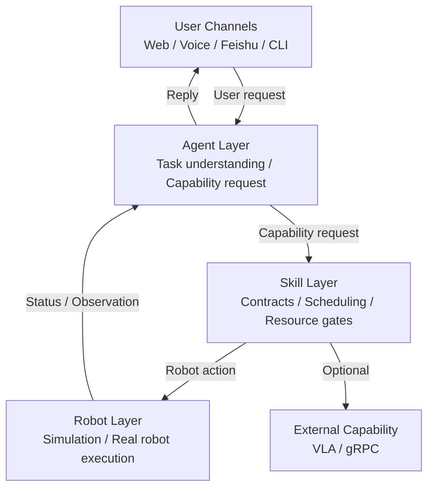

# Hey Robot

<div align="center">
  <sub><a href="../README.md">简体中文</a> | English</sub>
</div>

Hey Robot is an embodied Agent runtime for real robot deployment. The current main target is XLeRobot, combining an SO101 arm, a LeKiwi mobile base, camera observation, battery/status monitoring, and an LLM Agent runtime into a schedulable and recoverable robot system.

> Status: active development. The XLeRobot simulation and real-robot paths have both been brought up. Hardware changes should still be validated in simulation first.

## Features

- LLM Agent runtime for robot tasks.
- Skill-layer abstraction: the Agent requests capabilities instead of directly controlling hardware.
- MuJoCo simulation and XLeRobot real-robot deployment.
- Web, CLI, voice, and Feishu user channels.
- Task cockpit for task state, timeline, scene evidence, and recovery.
- VLA capability integration through an independent capability service.
- Execution feedback, resource gates, readiness gates, timeouts, and recovery flow.

## Architecture



Core boundaries:

- `Robot` represents the body and hardware execution boundary.
- `Skill` is the unified capability entry point for the Agent.
- The Agent requests robot skills through `request_capability` and does not submit `RobotAction` directly.
- `RobotService / RobotRuntime / PerceptionService` publish observations and camera frames.
- VLA capabilities are integrated through an independent capability service and are treated as optional extensions.

## Quick Start

### Requirements

- Python 3.12
- [uv](https://github.com/astral-sh/uv)
- NATS server
- MuJoCo for XLeRobot simulation
- XLeRobot hardware for real-robot deployment

### Install

```bash
uv sync --dev
```

For simulation:

```bash
uv sync --dev --extra sim
```

### Environment

```bash
cp .env.example .env
```

Common provider variables:

```text
DEEPSEEK_API_KEY
DEEPSEEK_MODEL
DASHSCOPE_API_KEY
DASHSCOPE_MODEL
ARK_API_KEY
```

### Start NATS

```bash
nats-server
```

Or with Docker:

```bash
docker compose up nats
```

### Run XLeRobot Simulation

```bash
uv run hey-robot run --config configs/xlerobot.sim.windows.yaml
```

Ubuntu simulation config:

```bash
uv run hey-robot run --config configs/xlerobot.sim.ubuntu.yaml
```

Default Web entry:

```text
http://127.0.0.1:8080
```

## XLeRobot Real Robot

Before running on real hardware, validate the platform and device mapping:

```powershell
uv run python scripts\ops\check_platform.py --config configs\xlerobot.real.windows.yaml
uv run hey-robot inspect --config configs\xlerobot.real.windows.yaml
uv run python scripts\robots\xlerobot\diagnose.py --config configs\xlerobot.real.windows.yaml
```

Start the full runtime:

```powershell
uv run hey-robot run --config configs\xlerobot.real.windows.yaml
```

The current XLeRobot real/sim configs expose these non-VLA skills by default:

```text
inspect_scene
look_around
detect_marker
move_base
turn_base
human_follow
stop_motion
reset_posture
set_arm_pose
move_arm_joints
set_gripper
```

VLA support is integrated as an optional capability extension and should be exposed to the Agent only after the capability service is stable.

## Safety

This project can command real robot hardware.

- Validate in simulation before using real hardware.
- Keep an emergency stop or power cutoff available.
- Do not test motion skills near people, pets, fragile objects, or unsafe environments.
- Re-run diagnostics after changing hardware, serial ports, servo IDs, or camera indices.
- VLA / foundation model capabilities must be validated separately before being exposed to the Agent.

## Development

```bash
poe style
poe lint
poe test
```

Or run directly:

```bash
uv run ruff check src tests
uv run mypy src
uv run pytest -q --no-cov
```

## Common Configs

- `configs/xlerobot.real.windows.yaml`: XLeRobot real robot on Windows
- `configs/xlerobot.sim.windows.yaml`: XLeRobot simulation on Windows
- `configs/xlerobot.sim.ubuntu.yaml`: XLeRobot simulation on Ubuntu

## Roadmap

The next focus is better robot interaction and long-horizon task capability in semi-open environments.

- Agent: memory, planning, and multi-turn correction.
- Skill: VLA, VLN, WAM, and other foundation model capabilities.
- Runtime: execution feedback, failure recovery, and task-state tracking.

## Repository Layout

```text
configs/                    deployment configs
docs/                       architecture, operations, development docs
frontend/views/             Web UI views
frontend/shared/            shared Web CSS and JS
proto/                      capability protobuf sources
src/hey_robot/agents/       Agent runtime, loop, core, task state
src/hey_robot/skills/       Skill registry, contracts, scheduler, builtin skills
src/hey_robot/robots/       Robot runtime and drivers
src/hey_robot/capability/   VLA/capability service and gRPC transport
src/hey_robot/perception/   observation pipeline and scene understanding
src/hey_robot/channels/     CLI / Web / Voice / Feishu channels
tests/                      unit and integration tests
```

## Documentation

The primary documentation language is Chinese. Start from the root [README](../README.md).

- [Runtime shape](./overview/runtime-shape.md)
- [System architecture](./architecture/system-architecture.md)
- [Agent and skill boundaries](./architecture/agent-skill-boundaries.md)
- [Capability RPC protocol](./architecture/capability-rpc-proto.md)
- [Deployment matrix](./operations/deployment-matrix.md)
- [XLeRobot real deployment](./operations/xlerobot-real.md)
- [XLeRobot simulation deployment](./operations/xlerobot-sim.md)
- [Runtime scripts](./operations/runtime-scripts.md)
- [Skill extension guide](./development/skill-extension.md)
- [Contributing guide](./development/contributing.md)

## References

- Workshop record: [XLeRobot hands-on workshop](https://mp.weixin.qq.com/s/TahLTjvvP9MoisCOCVkEBA)
- Architecture reference: [LimX Dynamics article](https://www.limxdynamics.com/zh/news/BK000054)
- Agent design reference: [HKUDS/nanobot](https://github.com/HKUDS/nanobot)
- XLeRobot official repository: [Vector-Wangel/XLeRobot](https://github.com/Vector-Wangel/XLeRobot)
- Feature reference: [choco-robot/HomeBot](https://github.com/choco-robot/HomeBot)
- More links: [Project references](./references/project-references.md)

## Contributing

Issues and pull requests are welcome. Before adding a new skill or hardware capability, read:

- [Contributing guide](./development/contributing.md)
- [Skill extension guide](./development/skill-extension.md)
- [Agent and skill boundaries](./architecture/agent-skill-boundaries.md)

Before submitting:

```bash
poe style
poe lint
poe test
```

## License

MIT License. See [LICENSE](../LICENSE).
